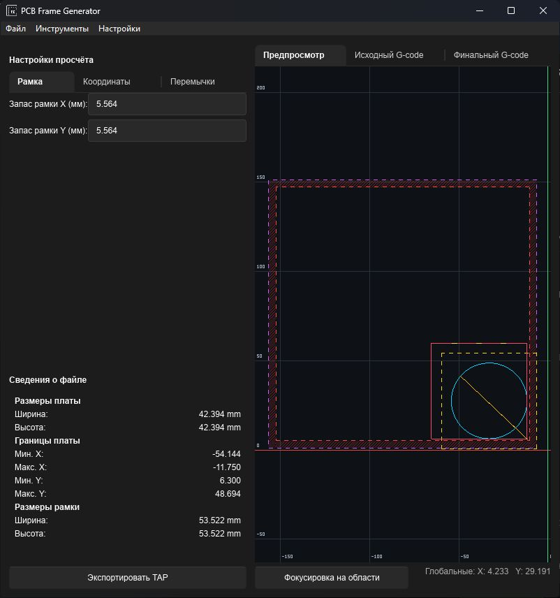
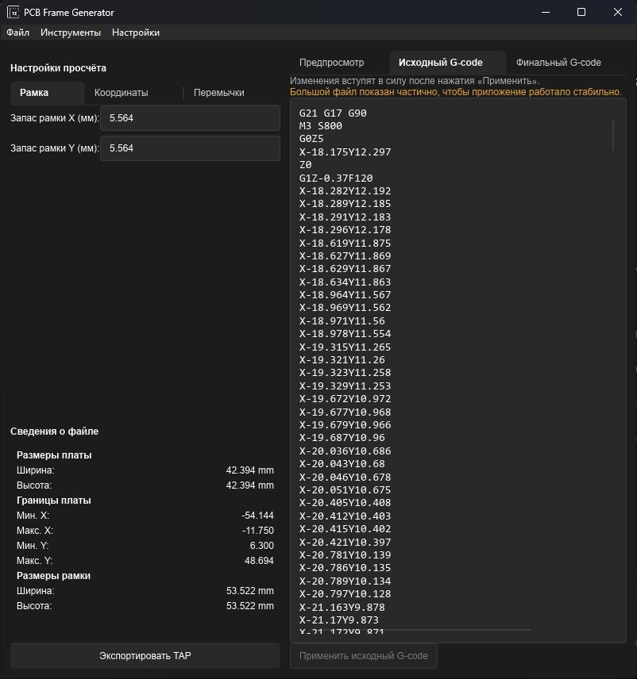
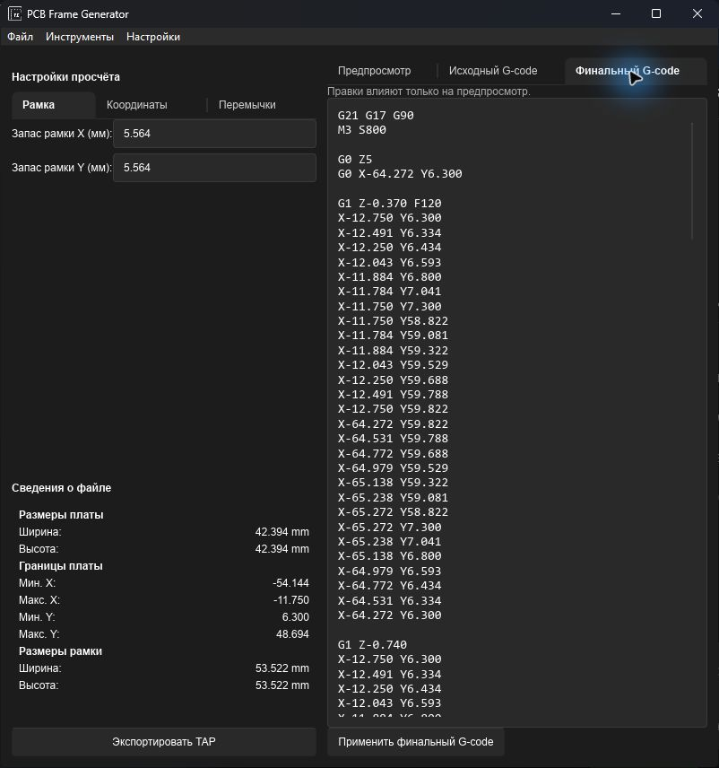

# PCB Frame Generator

Десктопное приложение для подготовки контура обрезки печатной платы на ЧПУ. Оно открывает управляющую программу платы, определяет её габариты и генерирует отдельный TAP-файл с рамкой, скруглёнными углами и удерживающими перемычками.

Приложение написано на Rust с интерфейсом Slint и ориентировано на работу в миллиметрах.

## Возможности

- Открытие файлов `*.tap`, `*.nc`, `*.gcode` и `*.ngc`.
- Определение границ платы и отображение её размеров.
- Расчёт рамки с настраиваемыми отступами по X и Y.
- Автоматическое размещение не менее трёх перемычек с контролем максимального промежутка между ними.
- Многоуровневый проход по глубине; параметры резания могут быть прочитаны из исходного G-code.
- Скругление углов контура.
- Локальный ноль программы и возврат в домашнюю точку исходного файла.
- Интерактивный предпросмотр: масштабирование колесом мыши, панорамирование, фокусировка и линейка.
- Отдельные вкладки для редактирования исходного и итогового G-code.
- Настройка отображения материала, безопасной зоны, сетки, осей, траектории и холостых ходов.
- Калькулятор отступов инструмента.
- Сохранение пользовательских настроек в `settings.json`.

## Интерфейс

### Предпросмотр

На примере круглой платы видны исходная траектория, холостые перемещения, материал, безопасная зона и рассчитанная рамка.



### Исходная программа

Исходный G-code можно проверить или отредактировать прямо в приложении. После правок нажмите «Применить исходный G-code», чтобы заново рассчитать габариты и рамку.



### Сгенерированная программа

Итоговый G-code содержит команды запуска шпинделя, безопасные перемещения, проходы по глубине, переходы через перемычки и завершение программы. Его также можно отредактировать и применить к предпросмотру.



## Быстрый старт

### Готовая сборка

Запустите `pcb-frame-generator.exe`, затем:

1. Откройте исходный файл через **Файл → Открыть TAP…**.
2. На вкладке «Рамка» задайте отступы по X и Y.
3. При необходимости настройте локальный ноль, материал, перемычки и отображение.
4. Проверьте рамку на вкладке «Предпросмотр».
5. Нажмите **Экспортировать TAP** и выберите место сохранения.

Перед использованием на станке обязательно проверьте итоговую программу, нулевые точки, инструмент, высоту безопасности и направление осей на конкретном оборудовании.

### Сборка из исходного кода

Требуются:

- Rust stable с Cargo;
- Windows;
- `windres` из MinGW-w64: он используется при сборке для встраивания значка приложения.

```powershell
cargo run
```

Для оптимизированной сборки:

```powershell
cargo build --release
```

Исполняемый файл будет создан по пути `target/release/pcb-frame-generator.exe`.

## Формирование контура

Программа берёт границы траектории резания `G1` из исходного файла. Рассчитанная рамка сохраняет правый нижний угол платы в качестве опорного, расширяя контур влево по X и вверх по Y. Отступы задают прирост с каждой стороны, поэтому полный размер рамки увеличивается на удвоенный отступ.

На верхней прямой стороне рамки создаются перемычки. При пересечении перемычки инструмент поднимается до безопасной промежуточной высоты, проходит её и возвращается к текущей глубине. Опция «Подрезать перемычки до половины глубины» оставляет их недорезанными только на глубоких проходах.

## Структура проекта

```text
src/
├── app/        # связывает UI с состоянием и действиями пользователя
├── domain/     # настройки, геометрия рамки и разбор G-code
├── export/     # генерация и запись итогового G-code
└── preview/    # сцена, камера, ввод и программные/OpenGL-рендереры
ui/             # Slint-окна, панели и общая тема
docs/images/    # скриншоты приложения для README
icons/          # ресурсы значка Windows
```

Геометрия хранится в мировых координатах в `PreviewScene`, а `Viewport` отвечает только за преобразование координат и масштаб. Рендереры получают неизменяемый снимок сцены и не меняют модель данных.

Подробности архитектуры приведены в [ARCHITECTURE.md](ARCHITECTURE.md).

## Проверка изменений

```powershell
cargo fmt
cargo check
cargo clippy
cargo test
```

## Лицензия

Лицензия в репозитории пока не указана.
